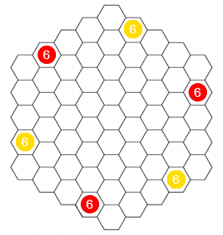
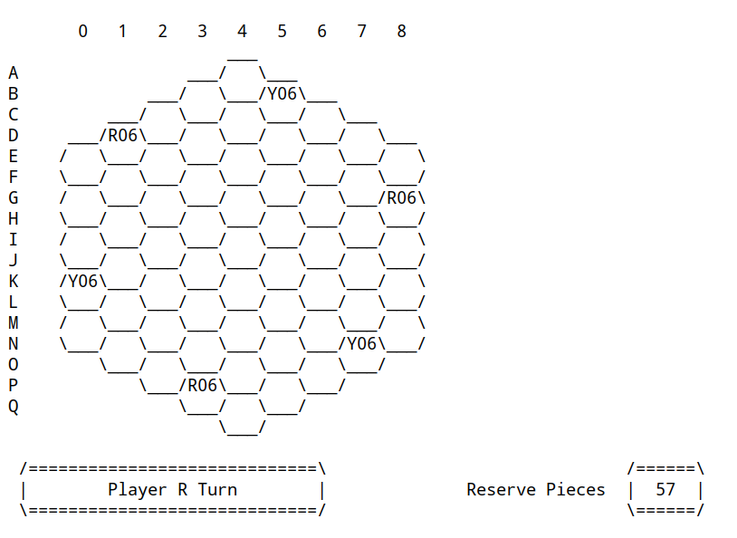
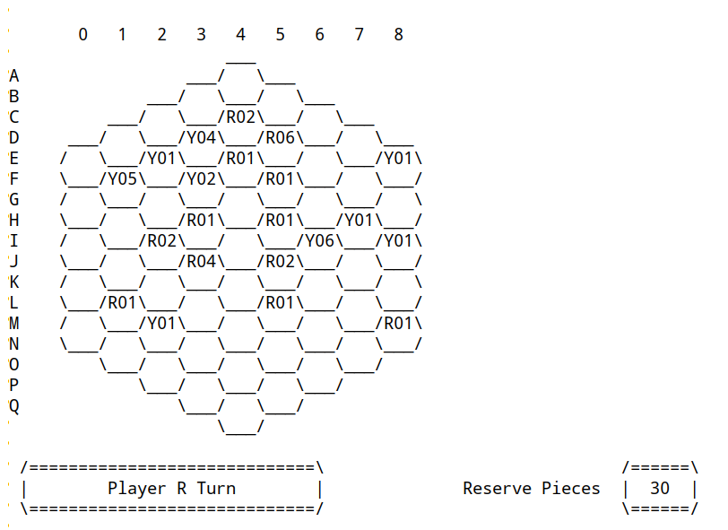
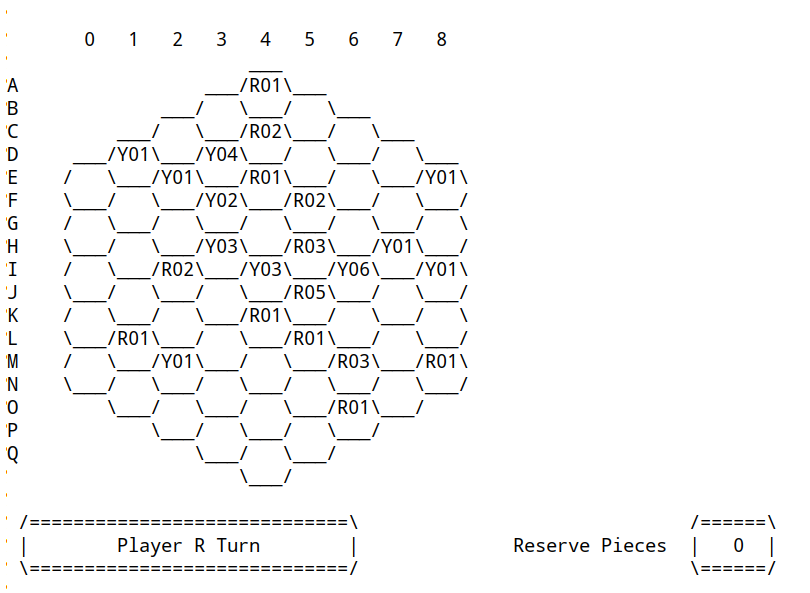
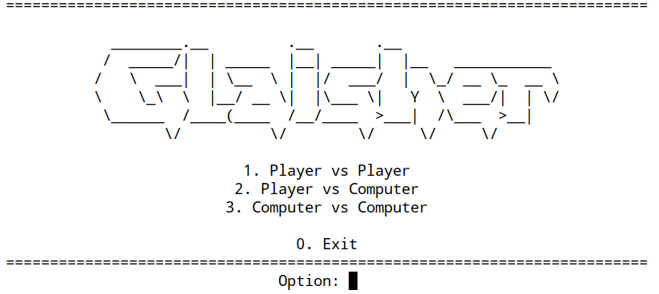
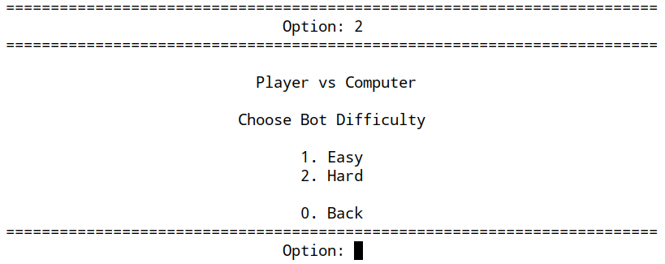
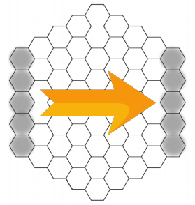

# GLAISHER

## **T3 Glaisher_1**


| Name                                     | Number    | E-Mail               |
| ---------------------------------------- | --------- | -------------------- |
| Pedro Jorge Fonseca Seixas               | 201806227 | up201806227@fe.up.pt |
| Telmo Alexandre Espirito Santo Baptista  | 201806554 | up201806554@fe.up.pt |

----
## **Installation and Execution**
There's no need for any configuration before running the game, apart from installing SICStus Prolog.
For this project it was used the 4.6.0 version of SICStus Prolog, if using a different version there's no confirmation the game will work properly.

Any font should be fine as long as it supports all ASCII characters.

To run the game in Windows using the graphic interface:
1. Open SICStus Prolog
2. Open `File` > `Consult` > `Select glaisher.pl located in directory /src of this project`

If running the game via console:
1. Open SICStus Prolog
```prolog
:-prolog:set_current_directory('/full/path/to/project/directory').
consult('./src/glaisher.pl').
```
or simply
```
consult('/full/path/to/project/src/glaisher.pl').
```

In both cases, after loading the file, you can play the game via running the command `play`, like so:
```prolog
play.
```
----
## **The Game: Glaisher**
### **Game Description**

Glaisher is a 2-player board game where each player has the objective of connecting two opposite sides of the hexagonal board with a contiguous chain of stacks of his color in order to win the game.

The player can move by choosing a direction and partiotioning his stack into integer partitions with distinct parts, i.e., splitting numbers into sets of different smaller numbers and moving each substack the number of cells corresponding to their height.

Game page can be found *[here](https://nestorgames.com/#glaisher_detail)*.

### **Preparing the game**

- Each player has a color (red or yellow) and starts with 18 pieces (3 stacks of 6 pieces).
- The remaining 57 pieces are kept as a reserve shared by both players.
- The starting positions are shown below:



- Another option is to start with the board empty, and in the first 3 turns of each player they must place a stack of 6 pieces on any empty hex of the board.

### **Rules**

- At the each turn, the player must do two actions in order.
  1. [Separate and move a stack](#separate-and-move-a-stack)
  2. [Place a new piece](#place-a-new-piece)

- It isn't allowed to skip the separate and move action, therefore if the player can not perform it, the player automatically looses.

- Stacks of 1-piece and 2-pieces cannot be separated.
- Stacks of 3-pieces and 4-pieces only have one possible separation (2-1 or 3-1, respectively). Thus having a 2-piece or taller stack right next to a 3-piece or 4-piece stack blocks the opponent movement with that stack on that direction.
- Stacks of 6-pieces can be separated into three sub-stacks maximum.
- Stacks of 10-pieces or taller can be separated into four sub-stacks maximum due to board size.
- Stacks of 11-pieces or taller at the center of the board are immobile because any valid separation requires them to exit the board.

[Source for the rules of the game](https://nestorgames.com/rulebooks/GLAISHER_EN.pdf)

#### **Separate and Move a Stack**

The player must choose a stack to separate into two or more sub-stacks:
  - the sub-stacks mustn't have the same height;
  - each sub-stack moves the number of hexes equal to its heigth;
  - the sub-stack can move over any stack in-between the original stack position and the position to where the sub-stacked moved, as long as it stays inside the game board;
  - if the destination hex of the moving sub-stack is occupied by own's stack, the sub-stack is merged creating a new taller stack on that destination hex;
  - if the destination hex of the moving sub-stack is occupied by an opponent's stack, then:
    - the separation is invalid if the opponent's stack is taller than the moving stack,
    - the opponent's stack gets captured, creating one taller stack for the moving player if the opponent's stack is smaller or same heigth as the moving stack;

#### **Place a new Piece**
From the reserve pieces, the player must place one piece on an empty place on the board making it a stack of height 1.

----
## **Game Logic**

### **Internal Representation**

The game is centered on the pieces on the board and the reserve pieces, so we opted to display both, as it's useful information for the player.

The board is represented with a matrix 17x9, due to our board being hexagonal.
Each cell of the matrix is represented by a value, the stack height, or the character `_`.

The stack height can assume three different types of values:
- **X = 0** : the cell doesn't have any stack, thus not owned by any of the players;
- **X < 0** : the cell has a red player's stack with height X;
- **X > 0**: the cell has a yellow player's stack with height X.

The character `_` is used to represent a position of the matrix that isn't part of the board itself, these are used as fillers to have a consistent number of columns between rows so that finding the adjacent pieces is easier.

The game state is then represented by a list containing the remaining reserve pieces and the board matrix, i.e, the game state is represented as `[Reserve, BoardMatrix]`, where `BoardMatrix` is a list of lists.

#### **Board examples**

**Initial Board**

```prolog
initial([57, [
    [ '_', '_', '_', '_',   0, '_', '_', '_', '_'],
    [ '_', '_', '_',   0, '_',   6, '_', '_', '_'],
    [ '_', '_',   0, '_',   0, '_',   0, '_', '_'],
    [ '_',  -6, '_',   0, '_',   0, '_',   0, '_'],
    [   0, '_',   0, '_',   0, '_',   0, '_',   0],
    [ '_',   0, '_',   0, '_',   0, '_',   0, '_'],
    [   0, '_',   0, '_',   0, '_',   0, '_',  -6],
    [ '_',   0, '_',   0, '_',   0, '_',   0, '_'],
    [   0, '_',   0, '_',   0, '_',   0, '_',   0],
    [ '_',   0, '_',   0, '_',   0, '_',   0, '_'],
    [   6, '_',   0, '_',   0, '_',   0, '_',   0],
    [ '_',   0, '_',   0, '_',   0, '_',   0, '_'],
    [   0, '_',   0, '_',   0, '_',   0, '_',   0],
    [ '_',   0, '_',   0, '_',   0, '_',   6, '_'],
    [ '_', '_',   0, '_',   0, '_',   0, '_', '_'],
    [ '_', '_', '_',  -6, '_',   0, '_', '_', '_'],
    [ '_', '_', '_', '_',   0, '_', '_', '_', '_']
]]).
```
Visualization in Prolog



**Intermediate Board**

```prolog
intermediate([30, [
    [ '_', '_', '_', '_',   0, '_', '_', '_', '_'],
    [ '_', '_', '_',   0, '_',   0, '_', '_', '_'],
    [ '_', '_',   0, '_',  -2, '_',   0, '_', '_'],
    [ '_',   0, '_',   4, '_',  -6, '_',   0, '_'],
    [   0, '_',   1, '_',  -1, '_',   0, '_',   1],
    [ '_',   5, '_',   2, '_',  -1, '_',   0, '_'],
    [   0, '_',   0, '_',   0, '_',   0, '_',   0],
    [ '_',   0, '_',  -1, '_',  -1, '_',   1, '_'],
    [   0, '_',  -2, '_',   0, '_',   6, '_',   1],
    [ '_',   0, '_',  -4, '_',  -2, '_',   0, '_'],
    [   0, '_',   0, '_',   0, '_',   0, '_',   0],
    [ '_',  -1, '_',   0, '_',  -1, '_',   0, '_'],
    [   0, '_',   1, '_',   0, '_',   0, '_',  -1],
    [ '_',   0, '_',   0, '_',   0, '_',   0, '_'],
    [ '_', '_',   0, '_',   0, '_',   0, '_', '_'],
    [ '_', '_', '_',   0, '_',   0, '_', '_', '_'],
    [ '_', '_', '_', '_',   0, '_', '_', '_', '_']
]]).
```

Visualization in Prolog



End Board

```prolog
final([0, [
    [ '_', '_', '_', '_',  -1, '_', '_', '_', '_'],
    [ '_', '_', '_',   0, '_',   0, '_', '_', '_'],
    [ '_', '_',   0, '_',  -2, '_',   0, '_', '_'],
    [ '_',   1, '_',   4, '_',   0, '_',   0, '_'],
    [   0, '_',   1, '_',  -1, '_',   0, '_',   1],
    [ '_',   0, '_',   2, '_',  -2, '_',   0, '_'],
    [   0, '_',   0, '_',   0, '_',   0, '_',   0],
    [ '_',   0, '_',   3, '_',  -3, '_',   1, '_'],
    [   0, '_',  -2, '_',   3, '_',   6, '_',   1],
    [ '_',   0, '_',   0, '_',  -5, '_',   0, '_'],
    [   0, '_',   0, '_',  -1, '_',   0, '_',   0],
    [ '_',  -1, '_',   0, '_',  -1, '_',   0, '_'],
    [   0, '_',   1, '_',   0, '_',  -3, '_',  -1],
    [ '_',   0, '_',   0, '_',   0, '_',   0, '_'],
    [ '_', '_',   0, '_',   0, '_',  -1, '_', '_'],
    [ '_', '_', '_',   0, '_',   0, '_', '_', '_'],
    [ '_', '_', '_', '_',   0, '_', '_', '_', '_']
]]).
```
Visualization in Prolog



---

## **Game State Visualization**

When the game starts, the main menu is presented with three options: 
- `Player vs Player`
- `Player vs Computer`
- `Computer vs Computer`

Each of the options is self explanatory, the first is the game mode played by two players, the second is a player against a bot and the third is two bots facing each other.



If you choose any of the options with bots, a new menu is shown to select the bot difficulty for each bot.



After these choices, the game starts. The board is displayed on the screen when the predicate `display_game` is called. This predicate receives the `GameState` and the `Player` as input and displays the board (using predicates `print_column_numbers` and `print_board`) and the player turn (using `print_player_turn`).

The predicate `print_column_numbers` prints the column numbers on the top of the board.

The predicate `print_board` prints each line of the board, including the row letters and is divided into multiple clauses due to the board format. This predicate makes use of the predicate `print_line` and `print_line_length5` that prints a single row.

Since the board had an hexagonal structure, we needed to divide our predicate to draw not only the different parts of the board that were common, but also the edge cases. When the `print_board` is called, we take care of the first edge case, the top line of the top cell of the board. After that, we divide the predicate into three main categories: when a line has 5 cells in it, when a line has more cells than the previous line and the rest. The only difference in this predicates is the way that the line is drawn, weather if it starts with the bottom of a cell of the previous line, or the cell itself. 
To help with this, the predicates `print_line` and `print_line_length5` are used and are responsible for printing an entire line.

The predicate `print_player_turn` receives the player and the number of reserve pieces as arguments and prints the player turn and the number of reserve pieces still available to play.

All these predicates are defined [here](./src/display.pl).

The user input is handled using the predicates `read_number/1` and `read_char/1` that read a number/char, respectively, and validate it by verifying if it's within the correct range in the ASCII table. All inputs are made via `get_code` as the user is only required to input a single character per input.

There's two main interactions with the user:
- Predicate `read_move/3` that reads a move of splitting a stack and moving it and validates it step by step.
- Predicate `read_placing/2` that reads a move of placing a new piece on the board and validates it step by step as well.

The predicate `read_move` starts by reading a position to move using the predicate `read_position`. The later reads the row letter followed by the column number and validates it by verfiying if the position is within the board using the predicate `valid_position`, after it further verifies it if it's a stack that can be split by the player using the predicate `valid_move_positions` to verify if there's any move possible to be made with that stack.

After reading the position it reads the direction to where the stack should be split to using the predicate `read_direction`. This predicate reads the direction via a number and then validates if that direction has possible moves for the player using the predicate `validate_direction`.

To finalize, it is read the stack division desired via the predicate `read_substack_divisions` that displays a list of possible divisions if the number of possible moves is less than 9, otherwise it asks to input manually the divisions using the predicate `read_stack_heights`. After reading the divisions desired it validates the move by checking if it's part of the list of possible moves.

The predicate `read_placing` functions in a similar way, but it only has one step. That step is reading an empty position of the board for the piece to be placed on, the validation process is only verifying if the position input is indeed an empty position, without any stack from any player.

All the input predicates can be found [here](./src/input.pl).
The

---
## **Valid Moves**

In this game, each turn consists in two parts:
1. [Separate and move a stack](#separate-and-move-a-stack)
2. [Place a new piece](#place-a-new-piece)

To get the valid moves for the first part of the turn it was implemented the predicate `valid_moves` which returns a list with all the valid moves given a board and a player.

This predicate searches for every stack of the given player and then, for each stack, generates the possible moves in each direction and each possible partition of the stack. 

To achieve this, we needed to implement the following predicates:
```prolog
% Get stacks of the given player
get_player_stack_positions(Board, Player, StackPositions).

% Get the valid moves for a given position
valid_moves_position(Board, Player, StackPosition, StackMoves).

% Get the valid moves for a given position in a given direction
valid_moves_direction(Board, Player, Position, Direction, DirectionMoves).

% Get the possible integer partitions given a stack size
get_integer_partitions(StackValue, Partitions).
```

For the second part of the turn, the only predicate needed was the following, to be able to get the valid positions to place a new piece:
```prolog
% Get the empty positions of the board
get_empty_positions(Board, Placings).
```

All predicates can be found [here](./src/game.pl).

---
## **Move Execution**
Due to the nature of the move on our game, we decided to separate the intended `move` predicate into two, in order to ease the implementation and even the interaction with the user, thus two predicates were born:
1. First, it is called the predicate `move` which takes the Board and the Move as arguments, and returns the new Board after the first move of the turn, i.e, when the player separates a stack into substacks and moves them in a direction.
2. After this, it is called the predicate `place`, with the same arguments of the previous one, but instead of the Move, it is given the position to place a new piece in the board.

The predicate move starts by calculating the offset of the position for each substack by using the predicates `direction` that gets the offset values for a certain direction, and then increments to the initial position having the increments be multiplied by the substack height to match the rules of the game.

After that it's calculated the new value for the stack in that position using the predicate `calculate_stack_value` that calculates the new height taking into account the act of capturing the current stack (as stacks are defined by negative or positive numbers, zero being neutral, we only have to add the absolute value of the current stack to the height of the substack and then apply the correct sign depending on player).

The move for that substack is concluded by calling `set_stack` that changes the board itself. After that the predicate `move` is called recursively for the rest of the substacks.

The predicate `place` only receives the position and uses `set_stack` to set the value to 1 or -1 depending on the player.

This second movement is only done if there's enough pieces in the reserve slot. That verification and update is done in the game main loop defined [here](./src/glaisher.pl).

The other predicates related to the movement can be found [here](./src/game.pl).

In order to get the Move and the Position to execute, depending on the player (User or Bot), we have different methods:
- **User**
    
    The user inputs the position using the predicates mentioned in [game state visualization](#game-state-visualization).

- **Bot**
    
    The predicates `choose_move` and `choose_placing` are used. Explained in a [following section](#computer-move).


---
## **Game Over**
The game over verification is divided into two verifications.

The predicate `game_over/3` receives the `Board`, the `Player` and outputs the `Result`. In this clause it is verified if the player has valid moves left on the board using the predicate `valid_moves` explained [here](#valid-moves), if it doesn't that means they lost and the `Result` is set to the next player, [more detailed information in rules](#rules).

If the player still has valid moves left, then the predicate `game_over/2` is called and it receives the `Board` and outputs the `Result`. In this clause it's verified if two opposite sides are connected, as that is the condition to win the game.

In order to verify if two opposite sides are connected, two auxiliar structures are used:
- `critical_points` - define points of the board to search. These points correspond to the cells on left side, upper left side and upper right side borders, since the rest of the borders are redundant due to being on the opposite spectrum of the board.
- `opposite_sides` - defines the opposite sides, it's structured as a list of lists, and each list contains two lists inside, one for a side and the other for its correspondent opposite.

Structures can be found in [here](./src/game.pl).

The predicate `game_over` makes use of the predicate `verify_all_points` that iterates over the critical points, and for each point it follows this algorithm:
- If point was already visited, skip to the next one.
- If the cell doesn't contain a stack, mark it as visited and skip to the next one.
- Build the path of cells via the predicate `build_path` that are connected and belong to the same player of the critical point in question, marking them as visited.
- It's called the predicate `has_opposite_sides` to verify if the path contains two points that are in opposite sides.
- If the point above ends on success, the player that owns that path is marked as the winner, otherwise continue searching the rest of the critical points that aren't visited.
- When there's no more critical points, the predicate `game_over` fails indicating the game isn't over.

The predicate `build_path` defined [here](./src/board.pl), performs a search on the board from a starting point, adding all stacks that connected to the path, its behaviour is similar to a DFS (depth-first-search).

The predicate `has_opposite_sides` defined [here](./src/game.pl), verifies if a list contains two points that are in opposite sides, it first loads the list of opposite sides using `opposite_sides` and then searchs for every pair of opposite sides if the path has common elements with the side and its opposite using the predicate `has_common_elements`.

The predicate `has_common_elements` defined [here](./src/utils.pl) receives two lists as argument and verifies if the first list has any common element with the second list.

---
## **Board Evaluation**
For the board evaluation, the predicate `value` is used, and returns the value of a given Board for a given Player.

### Board Regions
The board was divided into three regions:
1. Left to Right (LR): Connection between the left and the right sides
2. Upper Left to Bottom Right (ULBR): Connection between the upper left side and the bottom right
3. Upper Right to Bottom Left (URBL): Connection between the upper right side and the bottom left

  

### Algorithm
1. For each stack of the player, calculate the connected stacks using `build_path` already explained [here](#game-over).
2. For each connected region:
    * For each board region (LR, ULBR, URBL) calculate the number of unique columns (after board transformation) connected
    * (board transformation results from a theoric rotation in order to align the opposite sides in a horizontal orientation)
3. The final value of the connected region is the maximum value of the three regions of the board
4. The final value of the turn is the maximum value of the connected regions obtained previously

The predicate `value/3` receives the `Board` and the `Player` as arguments and outputs the `Value`. It starts by getting all the stack positions of the player specified using the predicate `get_player_stack_positions` and calls the predicate `value/6` that receives the `Board`, `Player`, `StackPositions`, the list containing the positions visited `Visited` and the current best value `BestValue` and outputs the `Value`. As initial values `Visited` is an empty list and `BestValue` is set to 0. The predicate `value/6` follows the algorithm above, and uses the predicate `path_value` to calculate the value of a path in a region (LR, ULBR and URBL).

The predicate `path_value` receives a `Path` and counts the number of unique columns in the path after transformation of board in order for that region to be aligned horizontally.

The transformation functions are defined as `transform/3` that receives the `Region`, the `Position` to transform and outputs the transformed `Column`.

The definition of the transformation functions can be found [here](./src/utils.pl).

---
## **Computer Move**
To choose computer move, the predicates `choose_move` and `choose_placing` were created. This predicates receives as arguments the Board, the current Player, the bot Difficulty and returns the choosen move or placing position.

The bot difficulty determines if the bot should choose the best move (greedy) or a random one. 
- **Easy**

    For the first part of the turn, the predicate `valid_moves` is called and it is choosen a random move from the list. To choose the placing position, it is also choosen randomly a position from the empty positions list.

- **Hard**

    For this bot, we created two helper prdeicates:
    ```prolog
    % Returns the list of valid moves sorted by their resulting board value, from best to worse
    getSortedByValueMoves(Board, Player, SortedMoves).

    % Returns the list of empty positions sorted by their resulting board value, from best to worse
    getSortedByValuePlacings(Board, Player, Placings).
    ```

    Both of these predicates work by generating all the possible moves using the predicates `valid_moves` and `get_empty positions`, respectively, already explained in an earlier section, followed by a `findall` in order to calculate the value of the board after the specific move using the predicate `value` also explained earlier.

    At the end, the list generated by `findall` contain compound terms in the format of `Value-Move` and `Value-Placing` respectively and the list gets sorted and then reversed in order for the best move to be placed on the top of the list to be easily obtained by the AI.

    After calling this predicates, the choosen move is the head of the list, i.e, the best possible move.
---
## **Conclusions**
With this work we were able to successfully learn and work with the prolog language by making a fully playable game with the option to play against the own computer.

This game truly became a challenge when we started to implement the needed algorithms to make it work, as it had an hexagonal board and a complex set of rules, with a lot of edge cases that needed to be taken care. At the end of the work, we are very satisfied with the work done, since we were able to make a working game with a simple and easy to understand interface with the user despite the great difficulty of this game.

The thing that could be done to make this game even better was to implement real artifial intelligence in the game so that the bots could have more than just two levels of difficulty, making it a lot more fun to play with, since it had a wide range of different thinking styles. The option to predict the best move the other player could make was also an option considered, but due to time limit it wasn't implemented, even tho the implementation of the AI allows it to be simple enough.

## **Bibliography**
- *PLOG slides presented by the regent*
- *Game Page* - https://nestorgames.com/#glaisher_detai
- *Game Rules* - https://nestorgames.com/rulebooks/GLAISHER_EN.pdf